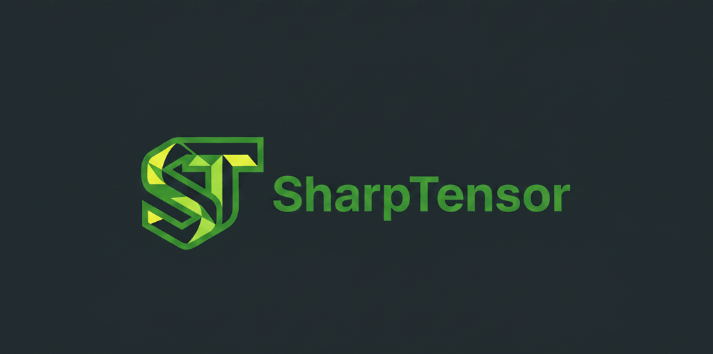

<p align="center">
  
</p>

# SharpTensor 🎯

**SharpTensor** is an elite, high-performance **Local-First Web Application** specifically designed for preparing image datasets for YOLO training. It bridges the gap between web flexibility and desktop performance, leveraging modern browser APIs to provide a seamless, secure, and lightning-fast labeling experience.


[](https://sharptensor.andhiyaulhaq.workers.dev/)

---

### [🚀 Try SharpTensor Live!](https://sharptensor.andhiyaulhaq.workers.dev/)


---

## 💎 The SharpTensor Advantage

Unlike traditional annotation tools, SharpTensor runs entirely in your browser while maintaining direct access to your local files. 

- **🚀 AI-Powered Efficiency**: Integrated **Ultralytics YOLOv8n** and **MobileSAM** for intelligent auto-labeling and interactive segmentation.
- **🚀 Zero-Latency Canvas**: 60FPS zooming and panning powered by a hardware-accelerated HTML5 Canvas engine.
- **📁 Local-First Architecture**: Uses the modern `File System Access API` to read and write directly to your local folders. No uploads, no servers, no privacy concerns.
- **🏷️ Professional Workflow**: Features a "Draw-to-Define" initialization flow and quick class assignment to maximize labeling throughput.
- **🎨 Premium UI/UX**: A state-of-the-art dark-themed interface with glassmorphism, fluid animations, and a responsive workspace designed for long-duration sessions.
- **🛡️ 100% Private**: Your data never leaves your machine. Processing happens entirely on the client side.

---

## ✨ Key Features

- **Advanced Explorer**: Real-time dataset navigation with visual labeling status indicators.
- **AI Batch Processing**: Rapidly auto-label entire directories using standard COCO-80 pretrained models.
- **Interactive Segmentation**: Use MobileSAM to generate pixel-perfect masks with single-click precision.
- **YOLO Optimized**: Native support for `.txt` normalized coordinates and automatic `classes.txt` management.
- **Global Migration Engine**: Intelligently handles class deletions by re-indexing your entire local dataset on-the-fly.
- **Custom Modal System**: Glassmorphism-based interaction for class management and critical actions.
- **Adaptive Workspace**: Intelligent auto-fitting and centering for images of any resolution (up to 4K+).

---

## 🛠️ Technology Stack

- **Platform**: Modern Web Browser (Chrome/Edge recommended for File System API)
- **Core**: Vanilla JavaScript (ES6+)
- **Build Tool**: [Vite 5](https://vitejs.dev/)
- **Engine**: HTML5 Canvas (Hardware Accelerated)
- **Styling**: Premium CSS3 (Custom Properties, Backdrop Filters, Flex/Grid)

---

## 🚀 Getting Started

### Prerequisites
- [Node.js](https://nodejs.org/) (v18 or higher)
- A modern browser with **File System Access API** support.

### Installation
1. Clone the repository:
   ```bash
   git clone https://github.com/andhiyaulhaq/SharpTensor.git
   cd SharpTensor
   ```
2. Install dependencies:
   ```bash
   pnpm install
   ```

### Development
Start the local development server:
```bash
pnpm dev
```
Open your browser and navigate to the local URL provided by Vite.

---

## 🎹 Keyboard Shortcuts

SharpTensor is designed for high-speed, keyboard-driven labeling.

| Key | Action |
|-----|--------|
| `W` | **Draw Mode** - Create new bounding boxes |
| `V` | **Select Mode** - Move or resize existing boxes |
| `D` | **Next Image** - Auto-saves current progress |
| `A` | **Previous Image** |
| `1-9` | **Quick Assign** - Instantly change class of selected box |
| `Del / Backspace` | Delete selected bounding box |
| `Space (Hold)` | Pan view |
| `Ctrl + Scroll` | Smooth Zoom |

---

## 🗺️ Roadmap

- [x] **Phase 1**: High-Performance Canvas Engine & State Management
- [x] **Phase 2**: Local File System Integration & YOLO Serialization
- [x] **Phase 3**: Premium UI/UX & Hotkey-Driven Workflow
- [x] **Phase 4**: Global Dataset Migration & Class Cleanup
- [ ] **Phase 5**: WebGPU Accelerated Auto-Labeling (Research)
- [ ] **Phase 6**: Multi-format Support (COCO, Pascal VOC)

---

## 📄 License

Distributed under the **GNU Affero General Public License v3.0**. See `LICENSE` for more information. 

> [!IMPORTANT]
> This project utilizes pretrained models from **Ultralytics (YOLOv8n)** and **Meta AI (MobileSAM)**. Your use of these models must comply with their respective licenses.

---

## 🙏 Acknowledgements

- **[Ultralytics YOLO](https://github.com/ultralytics/ultralytics)**: For providing state-of-the-art object detection models.
- **[MobileSAM](https://github.com/ChaoningZhang/MobileSAM)**: For the high-speed, lightweight interactive segmentation engine.
- **[ONNX Runtime Web](https://onnxruntime.ai/)**: For enabling high-performance AI inference directly in the browser.

---

Designed with ❤️ for the Computer Vision Community.

